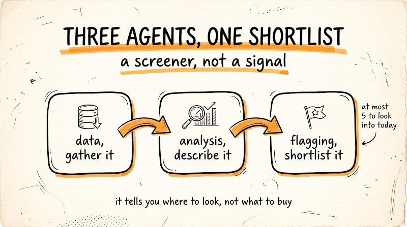

# Stock Market Analysis: Three Agents, One Shortlist

> A research screener, not a trading signal.

This project describes a three-agent workflow for finding unusual stock and
options activity that deserves human research. It is designed to narrow a
large watchlist to a small, evidence-backed shortlist. It does **not** attempt
to predict prices, identify "smart money," or recommend trades.

The workflow is based on the guide [How to Analyze the Stock Market with
Claude](https://docs.google.com/document/d/1uaVyrfoowR0TzEY7yW-nWuL1WU0YHjH-PnHw40T6Nj4/mobilebasic?urp=gmail_link).
The local prompt files are the project-specific starting point for the first
two sub-agents:

- [Data Agent prompt](agents/data-agent.md)
- [Analysis Agent prompt](agents/analysis-agent.md)
- [Flagging Agent prompt](agents/flagging-agent.md)

The guide defines the final **Flagging Agent** prompt and responsibilities;
there is not yet a corresponding local prompt file in this directory.



## What This Project Does

For each ticker in a watchlist, the workflow:

1. Gathers dated price, volume, options, open-interest, and event data.
2. Describes how unusual the activity is relative to that ticker's own history.
3. Flags at most five candidates for further research.
4. Identifies ordinary explanations before treating activity as noteworthy.
5. States what the available data cannot establish.

The output is an attention-direction tool: it answers **where should I look
next?**, not **what should I buy or sell?**

## Agent Architecture

```text
Watchlist
	 |
	 v
[Data Agent] ---> dated market-data file ---> [Analysis Agent]
																									|
																									v
																			analysis report and ranked flags
																									|
																									v
																					[Flagging Agent]
																									|
																									v
																	research shortlist: 0 to 5 tickers
```

Each sub-agent has a deliberately narrow responsibility. Keeping collection,
description, and prioritization separate reduces the chance that a model will
turn incomplete market data into a confident story.

### 1. Data Agent

The [Data Agent](agents/data-agent.md) gathers facts only. It must not analyze
the data or make recommendations.

For every ticker, it records:

- Daily price history for the last 90 days.
- Current price and current volume.
- Current volume relative to the ticker's own 30-day average.
- Today's total options volume, split into calls and puts.
- Open-interest changes at the most active strikes, not only contract volume.
- Earnings, dividend, and other scheduled events in the next 30 days.

Every figure must include its source and timestamp. Missing values must be
recorded as `UNAVAILABLE`; they must never be estimated or silently carried
forward from a previous day. Each run should be saved to a dated file so that
later runs can be compared consistently.

#### Data Agent output requirements

The data file should make it possible to answer all of these questions without
guessing:

- When was this value retrieved?
- Where did it come from?
- Is it delayed, unavailable, or observed directly?
- What was the comparable historical baseline?
- Did open interest increase or decrease at the active strikes?

Open-interest change is especially important. Options volume alone cannot show
whether contracts represent newly opened positions or positions being closed.

### 2. Analysis Agent

The [Analysis Agent](agents/analysis-agent.md) reads the dated data file and
describes relationships in the data. It must not recommend a trade.

For every ticker, it reports:

- Where today's options volume falls relative to the ticker's normal range.
- Today's call-to-put ratio compared with its 30-day average.
- Whether open interest increased or decreased at active strikes.
- Whether price action confirms or contradicts the options activity.
- Whether a scheduled event could explain the activity.

It then identifies cases where unusual options volume appears to have opened
new positions while the price has not moved correspondingly. These are
research candidates, not bullish or bearish signals.

For each candidate, the analysis must state what cannot be determined from the
data, including:

- Whether the reported volume was bought or sold.
- Whether the counterparty opened or closed its position.
- Whether the activity is directional or a hedge.

Candidates are ranked by how unusual the activity is for that specific ticker,
not by the absolute number of contracts. A large number can be normal for a
large, liquid stock.

### 3. Flagging Agent


The [Flagging Agent](agents/flagging-agent.md) converts the analysis into a
short research queue. It is a prioritization step, not a trade-decision step.

The agent must return at most five tickers worth investigating today. It should
return fewer than five when the evidence does not justify more flags, and it
should say plainly when nothing is genuinely unusual.

For each flagged ticker, it provides:

- The specific unusual measurements and their baselines.
- Whether open interest supports the possibility of newly opened positions.
- The most likely ordinary explanation, such as earnings, a dividend, an index
	rebalance, a known hedge, or sector-wide movement.
- The missing information that would determine whether the activity matters.
- A confidence level, using `LOW` when the evidence is weak or ambiguous.

The report ends with the single most useful question to research first.

## What Options Data Can and Cannot Tell You

### Volume does not reveal direction

Every options trade has a buyer and a seller. A print of 10,000 calls does not
show whether someone bought calls expecting a rise or sold calls to collect
premium. Inferring direction from volume alone adds a story that is not present
in the data.

### Open interest provides context, not intent

Open-interest changes help distinguish activity that may represent newly opened
positions from activity that may represent existing positions being closed.
That still does not identify the intent of either party or prove that the
position is directional.

### Hedging can look like a directional bet

Institutions may use options to hedge equity, options, or other exposures. A
large call or put trade can therefore be part of a risk-management strategy.
The workflow should describe the observed activity and its uncertainty rather
than label it as institutional conviction.

### Public information is delayed

Free market data may be delayed, incomplete, or occasionally wrong. Filings
that disclose institutional holdings, such as Form 13F reports, are also
published with a substantial delay. This workflow cannot provide a live view
of what an informed investor is doing.

## Suggested Daily Workflow

1. Define the watchlist and record the run date.
2. Run the Data Agent for every ticker.
3. Validate that every figure has a source and timestamp.
4. Confirm that unavailable values are marked `UNAVAILABLE` rather than filled.
5. Save the raw data to a dated file.
6. Run the Analysis Agent against that exact dated file.
7. Review the analysis for unsupported bullish or bearish language.
8. Run the Flagging Agent and limit the result to zero through five candidates.
9. Verify each flag against primary sources, filings, news, and the earnings
	 calendar.
10. Log what happened to each flag over the next two weeks.

The two-week follow-up log is essential. After roughly three months, it gives
you a measured hit rate instead of a memory biased toward the flags that worked.

## Recommended Data Record

The implementation can use JSON, CSV, or another structured format, but each
observation should carry equivalent fields:

| Field | Purpose |
| --- | --- |
| `ticker` | Identifies the security |
| `as_of` | Market date or observation date |
| `retrieved_at` | Timestamp when the value was collected |
| `source` | URL, API, exchange, or other origin |
| `value` | Observed value, or `UNAVAILABLE` |
| `unit` | Dollars, shares, contracts, ratio, and so on |
| `baseline` | Comparable historical reference when applicable |
| `notes` | Delay, caveat, event context, or data-quality detail |

Options records should additionally identify the expiration, strike, call/put
side, volume, and open interest before and after the observation when that data
is available.

## Current Repository State

At present, this directory contains the prompt-level design rather than a
complete executable collector or orchestration service:

```text
stock-market-analysis/
├── README.md
├── stock-market-analysis.png
├── flagging-agent.png
└── agents/
		├── data-agent.md
		└── analysis-agent.md
        └── flagging-agent.md
```

The next implementation steps are to add a dated data schema, a source-specific
collector, an analysis runner, the local flagging-agent prompt, and a follow-up
log for completed flags. Any implementation should preserve the separation of
responsibilities described above.

## Safety and Scope

This project is educational and is not financial advice. Options are leveraged
instruments that can expire worthless and can expose traders to losses beyond
the initial premium, depending on the strategy. A correct directional view can
still lose money when the timing is wrong.

Treat every flag as the beginning of research. Verify data at the source before
acting, understand the instrument and its risks, and never commit money that
you cannot afford to lose. The system is intentionally a screener, not a signal
generator or an automated trading system.

## Source

The conceptual workflow and agent instructions were adapted from:

- [How to Analyze the Stock Market with Claude](https://docs.google.com/document/d/1uaVyrfoowR0TzEY7yW-nWuL1WU0YHjH-PnHw40T6Nj4/mobilebasic?urp=gmail_link)

The local sub-agent prompts are maintained in this repository by
`prateep.mukherjee` and are versioned independently in the `agents/` directory.
